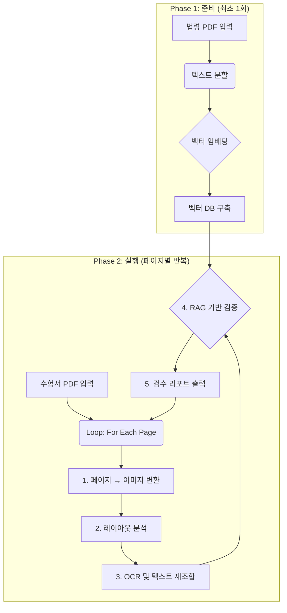

# 다단 편집 수험서 자동 검수 프로그램 워크플로우

본 문서는 다단 편집으로 구성된 수험서의 내용을 자동으로 검수하기 위해 설계된 시스템의 전체 동작 흐름을 정리합니다. 워크플로우는
**준비 단계**와 **실행 단계**의 두 구간으로 나뉘며, 각 단계는 다음과 같이 진행됩니다.

## Phase 1. 준비 단계: 지식 베이스 구축

이 단계는 프로그램 초기화 시 단 한 번만 수행됩니다. 최신 법령 PDF(`latest_safety_laws.pdf`)이나 텍스트 파일을 근거로 LLM이 참조할 지식 베이스를
미리 구성합니다.

1. **법령 문서 로드** – 시스템이 최신 법령 PDF 또는 텍스트 파일을 읽어 들여 전체 텍스트를 메모리로 가져옵니다. PDF 의존성(PPyPDF2 등)을 설치하기 어려운 환경이라면 `.txt` 형태로 변환해도 됩니다.
2. **텍스트 분할** – 법령 텍스트를 의미 단위로 분할해 후속 처리를 위한 청크를 생성합니다.
3. **벡터 임베딩 및 DB 구축** – 각 청크를 임베딩하여 벡터 데이터베이스를 구축함으로써, 관련 조항을 빠르게 검색할 수 있는 기반을
마련합니다.

## Phase 2. 실행 단계: 페이지별 자동 검수 루프

이 단계는 수험서 PDF(`sample_exam_book.pdf`)의 각 페이지에 대해 반복됩니다.

1. **입력 및 이미지 변환** – (PDF 모드) 수험서 PDF의 페이지를 고해상도 이미지로 변환합니다. 외부 라이브러리 설치가 어려운 환경이라면 미리 텍스트 파일로 변환해 두고 본 과정을 생략할 수 있습니다.
2. **레이아웃 분석** – (PDF 모드) OpenCV 기반 레이아웃 분석으로 페이지의 단 구조(2단/3단)를 파악하고, 각 단 이미지를 개별적으로 분리합니다. 텍스트 모드에서는 문서가 이미 독서 순서에 맞게 정렬되어 있다고 가정합니다.
3. **순차적 OCR 및 텍스트 재조합** – (PDF 모드) 분리된 단 이미지를 좌측에서 우측 순으로 OCR 처리하고, 추출된 텍스트를 독서 순서에 맞춰 재조합합니다. 텍스트 모드에서는 입력 문장을 그대로 사용합니다.
4. **RAG 기반 LLM 검증** – 재조합된 페이지 텍스트를 질의로 사용하여 벡터 데이터베이스에서 관련 법규를 검색(Retrieve)하고, 검색된
 문맥과 페이지 텍스트를 함께 LLM에 제공해 검수 리포트를 생성(Generate)합니다.
5. **결과 출력** – 생성된 검수 리포트를 사용자에게 전달하고, 다음 페이지로 이동해 반복합니다.

## 전체 흐름 다이어그램



## 기대 효과

- **정확한 텍스트 추출**: 다단 편집을 고려한 OCR 순서 제어로 텍스트 순서 뒤바뀜을 방지합니다.
- **신뢰도 높은 검증**: 최신 법령 기반의 RAG 파이프라인을 통해 LLM이 사실에 근거한 검수를 수행합니다.
- **자동화된 반복 처리**: 페이지 단위 루프 구조로 전체 수험서를 자동 검수할 수 있습니다.

## 구현 개요

본 워크플로우는 `exam_proofreading` 패키지로 구현되어 있으며, 다음 구성 요소로 나뉩니다.

- `KnowledgeBaseBuilder` – PDF일 경우 `PyPDF2`로 텍스트를 추출하고, 텍스트 파일일 경우 그대로 읽어 들인 뒤 내장 TF-IDF 벡터라이저로 임베딩합니다.
- `ColumnDetector` – OpenCV를 활용해 2단/3단 레이아웃을 감지하며, 의존성이 없으면 단일 컬럼으로 처리합니다.
- `OCRProcessor` – `pytesseract`로 단 이미지를 좌에서 우 순으로 OCR 처리하고, OCR 모듈이 없으면 입력 텍스트를 그대로 사용합니다.
- `RAGValidator` – 검색된 법령 조각과 페이지 텍스트를 결합해 LLM에게 검수 리포트를 요청합니다.
- `ExamProofreader` – 위 단계 전체를 연결하여 페이지별 리포트를 JSON 형식으로 저장합니다.

## 로컬 저장 위치와 폴더 구조

- 저장소를 처음 클론하면 Git이 **현재 터미널의 위치**에 저장소 이름과 동일한 폴더(예: `exam-proofreading`)를 만듭니다.
- 폴더 안에는 다음과 같은 하위 경로가 있습니다.
  - `exam_proofreading/` – 실제 파이프라인 모듈 코드
  - `docs/` – 워크플로우 및 실행 가이드 문서
  - `pyproject.toml` – 패키지 메타데이터와 의존성 정의
- Windows에서는 대개 `C:\\Users\\사용자이름\\Documents\\exam-proofreading` 같은 경로에, macOS/Linux에서는 `~/exam-proofreading` 같은 경로에 위치합니다.
- 터미널에서 다음 명령으로 현재 위치와 폴더를 확인할 수 있습니다.

```bash
pwd            # 현재 위치 출력 (PowerShell에서는 Get-Location)
ls             # 폴더 목록 보기 (PowerShell에서는 dir)
```

- 탐색기/파인더에서 폴더를 열고 싶다면 해당 위치에서 다음 명령을 실행하세요.
  - Windows PowerShell: `explorer .`
  - macOS: `open .`
  - Ubuntu/Linux 데스크톱: `xdg-open .`

CLI 진입점은 `pyproject.toml`의 `exam-proofreader` 스크립트로 노출되며 다음과 같이 실행할 수 있습니다.

```bash
python -m exam_proofreading.cli sample_exam_book.pdf latest_safety_laws.pdf --output reports
```

실행 결과는 `reports/` 디렉터리에 페이지별 JSON 리포트와 요약 파일(`summary.json`)로 저장됩니다.

## 완전 초보용 실행 가이드 (차근차근 따라하기)

### 0. GitHub에서 코드 가져오기

1. GitHub 웹사이트에서 저장소 주소(예: `https://github.com/사용자/exam-proofreading.git`)를 복사합니다.
2. 터미널(또는 Windows PowerShell)을 열고, 코드를 보관할 위치로 이동합니다.
   ```bash
   cd ~/Documents            # Windows PowerShell은 Set-Location ~/Documents
   ```
3. 아래 명령으로 저장소를 내려받습니다.
   ```bash
   git clone https://github.com/사용자/exam-proofreading.git
   ```
4. 복제가 끝나면 `exam-proofreading` 폴더로 이동합니다.
   ```bash
   cd exam-proofreading
   ```

> **TIP**: 현재 위치를 잊어버리면 `pwd`(또는 PowerShell의 `Get-Location`) 명령으로 확인할 수 있습니다.

### 1. 필수 프로그램 설치

다음 두 가지 실행 모드 중 상황에 맞게 선택하세요.

1. **PDF 전체 기능 모드 (권장)**
   - Python 3.10 이상
   - [Tesseract OCR](https://github.com/tesseract-ocr/tesseract) (한국어 학습 데이터 `kor.traineddata` 포함)
   - `PyMuPDF` 또는 `poppler` 기반 PDF 렌더러
   - Windows: [Chocolatey](https://chocolatey.org/) 사용 시 `choco install python tesseract poppler`
   - macOS: Homebrew 사용 시 `brew install python tesseract poppler`
   - Linux(Ubuntu): `sudo apt install python3 python3-venv tesseract-ocr tesseract-ocr-kor poppler-utils`

2. **오프라인 텍스트 모드 (외부 패키지 설치 불가 환경)**
   - Python 3.10 이상만 있으면 됩니다.
   - 법령과 수험서 문서를 `.txt` 파일로 변환한 뒤 실행하면 OCR/레이아웃 단계 없이 동작합니다.
   - 예제용 텍스트 파일이 `samples/sample_law.txt`, `samples/sample_exam.txt`로 제공됩니다.

### 2. 가상환경 만들기 (선택 권장)

```bash
python -m venv .venv
source .venv/bin/activate              # Windows PowerShell은 .venv\Scripts\Activate.ps1
```

> 가상환경을 종료하고 싶다면 `deactivate` 명령을 입력하세요.

### 3. 의존성 설치

- **PDF 전체 기능 모드**: 저장소 루트(즉, `pyproject.toml` 파일이 있는 위치)에서 아래 명령을 실행해 필요한 패키지를 설치합니다.

  ```bash
  pip install --upgrade pip
  pip install -e .
  ```

  설치가 끝나면 CLI가 준비되었는지 `exam-proofreader --help` 명령으로 확인하세요.

- **오프라인 텍스트 모드**: 표준 라이브러리만 사용하므로 별도의 `pip install` 과정 없이 바로 실행할 수 있습니다.

### 4. 데이터 준비

- 검수 대상 수험서 PDF (예: `sample_exam_book.pdf`)
- 참조할 최신 법령 PDF (예: `latest_safety_laws.pdf`)
- 두 파일을 저장소 폴더 안이나 다른 경로에 넣고, 전체 경로를 메모해 둡니다.

> **오프라인 텍스트 모드 예시**: 저장소 안의 `samples/sample_exam.txt`와 `samples/sample_law.txt`를 그대로 사용하면 별도 준비 없이 데모를 실행할 수 있습니다.

### 5. 기본 실행

```bash
exam-proofreader sample_exam_book.pdf latest_safety_laws.pdf --output reports
```

- PDF가 다른 폴더에 있다면 전체 경로를 적어 주세요. 예: `exam-proofreader "C:\\자료\\sample.pdf" "C:\\자료\\laws.pdf" --output "C:\\자료\\reports"`
- 최초 실행 시 `knowledge_base.pkl`이 생성되며 이후 실행에서는 재사용됩니다.

> **텍스트 모드 빠른 실행 예시**
> ```bash
> python -m exam_proofreading.cli samples/sample_exam.txt samples/sample_law.txt --output demo_reports --log-level DEBUG
> ```
> 위 명령은 OCR·OpenCV 없이도 동작하며, `demo_reports/` 폴더에 샘플 리포트를 생성합니다.

### 6. 결과 확인

- `reports/` 폴더에 페이지별 `page_XXX.json` 리포트와 `summary.json`이 생성됩니다.
- Windows에서는 `explorer reports`, macOS에서는 `open reports`, Linux에서는 `xdg-open reports`로 폴더를 바로 열 수 있습니다.
- 로그 레벨을 조정하고 싶다면 `--log-level INFO`처럼 옵션을 추가하세요.

### 7. 자주 사용하는 옵션

- `--dpi 400` : PDF → 이미지 변환 해상도를 높여 OCR 정확도를 향상합니다.
- `--max-pages 10` : 앞쪽 10페이지만 시험 삼아 실행합니다.
- `--knowledge-base custom_cache.pkl` : 지식 베이스 캐시 파일명을 변경합니다.
- `--language kor+eng` : 한국어와 영어가 섞인 문서를 OCR 처리합니다.

### 8. 문제 해결 팁

- **OCR 결과가 비어 있음**: Tesseract가 설치되어 있는지, `kor.traineddata`가 `tessdata` 폴더에 있는지 확인합니다. Windows에서는 `where tesseract`, macOS/Linux에서는 `which tesseract`로 경로를 확인할 수 있습니다.
- **PDF 렌더링 실패**: `pip install pymupdf`로 파이썬 PDF 렌더러를 설치하거나, OS 패키지 관리자에서 `poppler` 관련 도구를 설치합니다.
- **경로 오류**: 경로에 공백이 있다면 따옴표로 감싸 주세요. (예: `"C:\\My Documents\\sample.pdf"`)
- **실행 중단 후 재시도**: `knowledge_base.pkl` 파일이 이미 있으면 다시 만들지 않고 그대로 사용합니다.
- GPU는 필요하지 않으며 CPU 환경에서도 실행 가능합니다.

필요 시 `exam-proofreader --help`로 전체 옵션을 확인할 수 있습니다.
